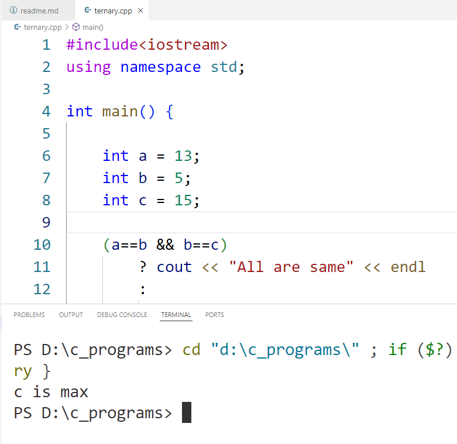

# 🚀 C++ Concepts Repository

Welcome to the **C++ Concepts Repository**! This repository contains multiple C++ files showcasing fundamental concepts such as arrays, reference variables, and control structures. Dive in and explore the building blocks of C++ programming! 💻✨

---

## 📂 Project Structure

```
/cpp_rw6c_programs/
├── array.cpp           // Array operations and examples
├── reference_variable.cpp  // Reference variables in action
├── ternary.cpp // If-else, loops, and switch-case
└── README.md           // Project documentation
```

---

## 📷 Screenshots



---

## 📜 Features

- 🧮 **Arrays**: Learn how to work with arrays in C++.
- 🔗 **Reference Variables**: Understand the power of references.
- 🔄 **Control Structures**: Master decision-making and loops.

---

## 🛠️ Getting Started

1. Clone the repository:
    ```bash
    git clone https://github.com/milankathiriya/cpp_rw6.git
    ```
2. Navigate to the project directory:
    ```bash
    cd cpp_rw6
    ```
3. Compile and run the desired file:
    ```bash
    g++ array.cpp -o array && ./array
    ```

---

## 🤝 Contributing

Contributions are welcome! Feel free to fork the repository, make changes, and submit a pull request. Let's learn and grow together! 🌟

---

Happy Coding! 🎉